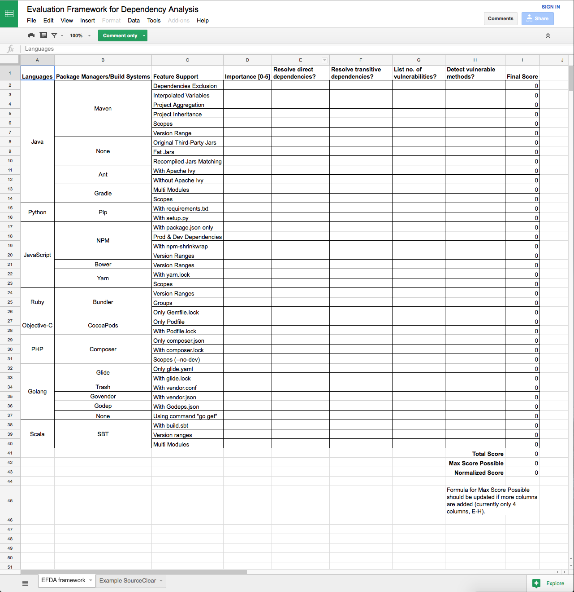

# Evaluation Framework for Dependency Analysis

#### If you are...
- Using open-source libraries,
- Using package managers to manage project dependencies,
- Concern about security vulnerabilities in the libraries you use,
- Deciding what product to use for checking open-source vulnerabilities,

then this open-source project is tailored for you!

**Evaluation Framework For Dependency Analysis** is a project that allows users to test the dependency analysis tool of their choice and see how accurate the tool is. We hope that with this project, users can compare the different dependency analysis/open-source security scanners out in the market and decide which tool works best for them.

This project comprises of projects implemented on different languages, build systems and possibly different type of setups for each build system. Each project also has a README file to describe the expected output of testing against the project (number of direct dependencies, transitive dependencies, etc).

### What is included in this project?
Projects implemented in:
 - Golang
 - Java
 - Ruby
 - Python
 - JavaScript
 - Objective-C
 - PHP
 - Scala
 - C/C++
 - C#

An [EFDA Spreadsheet](https://docs.google.com/spreadsheets/d/1rAmOxEQDw1SpKetbrGOqNU5YmfnRh_aFqrizU8D2MKk) that allows you to track the languages/package managers/features supported by the dependency analysis tool of your choice, customize the importance of each feature, and compute a score for the tool.

#### Frequently Asked Questions

###### I don't see any project implemented on the build system of my choice. Can I contribute?
Yes of course! If you do not see the programming language/build system or even a particular tricky setup of a build system of your choice, feel free to send a pull request to us.

###### Are the results reliable?
The projects are made simple on purpose. The point is to create projects with dependencies that we can easily track so that we can easily verify the output is correct. This means the projects usually consist of only a few dependencies and little code.

We are also testing the support for different project setups. For example, in the `java/maven/` directory, you can find projects with different types of Maven setup e.g. multi-modules, interpolated variables etc. A good dependency analysis tool should be able to support features provided by the build system.
